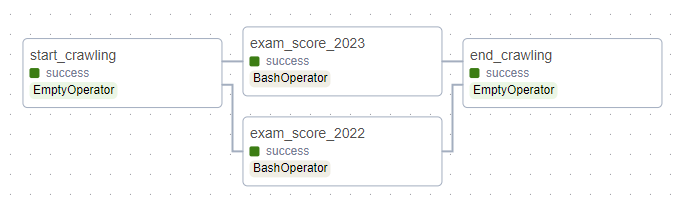
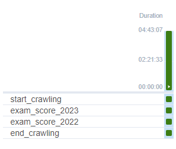
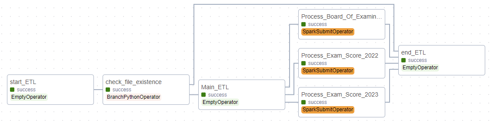
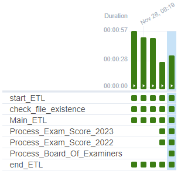

# Idea

* Design a ETL to fetch data National high school graduation exam in 2022 and 2023 on Web and visualize them.

* Each step uses different tools: 
    * Using **Scrapy** to fetch data.
    * Using **Spark** to extract-transfer-load data.
    * Using **Mongodb** to store final data.
    * Using **Airflow** to coordinate and manage above tasks.
    * Using **PowerBI** to visualize data.
    * Using **Docker** to deloy Airflow and Spark.

* Version: 
    * Docker - 24.0.6
    * Airflow - 2.7.3
    * MongoDB - 6.0.7
    * Spark - 3.5.0

* PowerBI - https://www.novypro.com/project/vietnamese-national-high-school-graduation-exam-in-2022-and-2023

* Model

    

# Deployment
All code file should be saved at project code which is a shared directoy.
## Build Airflow and Spark image

Set up the docker file and docker compose properly to run this project.

Run these command.

    #create shared directories between host and containers
    mkdir logs | mkdir config | mkdir dags | mkdir plugins | mkdir project_code 

    #to build image
    docker compose up airflow-init 

    # run containers
    docker compose up -d 

    # to stop and remove container
    dokcer compose down 

## Set up Scrapy

Create a scrapy project with ***scrapy startproject*** and ***scrapy genspider***.

In this project I use the following websites to crawl required data. ***These links may be not available by the time, recheck before use***:
* Exam Score 2023 (API link): https://api-university-2022.beecost.vn/university/lookup_examiner?id=01000001
* Exam Score 2022 (html): https://vietnamnet.vn/giao-duc/diem-thi/tra-cuu-diem-thi-tot-nghiep-thpt/2022/01000001.html

Go into setting file and uncomment this lines:

    #uncomment this line in setting file. To increase the speed of crawling.
    CONCURRENT_REQUESTS = 32

## Set up connection between tools

### Airflow to Spark

To use ***SparkSubmitOperator*** running Spark Job. Set Airflow Connection

### Spark to MongoDB

To connect **Spark** to **MongoDB** use this package:

    --packages org.mongodb.spark:mongo-spark-connector_2.12:3.0.2"

Besides, to connect Spark and other apps run on Container to MongoDB run on local host, change this:

    mongodb://localhost:27017 >> mongodb://host.docker.internal:27017

### MongoDB to PowerBI

To import data into PowerBI from MongoDB, must install following apps:

* MongoDB BI Connector.
* MongoDB ODBC Driver.
* Refer to this link to install and import data to MongoDB: https://www.youtube.com/watch?v=ZuqYZ1xEuzU

# Airflow DAGs Performance

**This DAG is used for crawling data.** **To crawl nearly 2 million records. It costs nearly 5 hours.**

**For Spark Job DAG**

